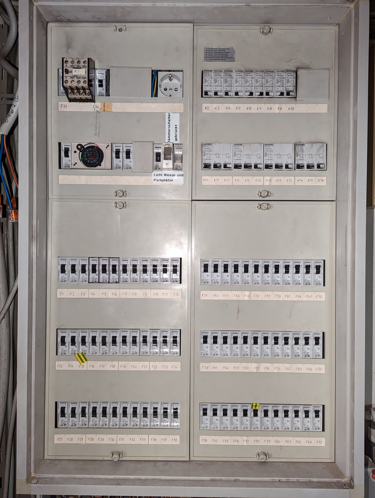
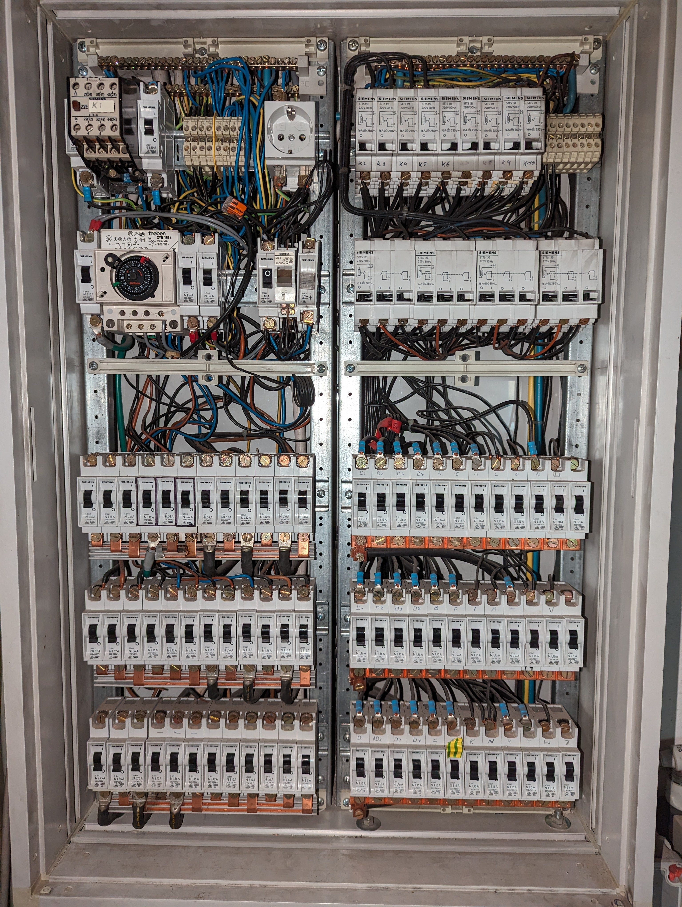
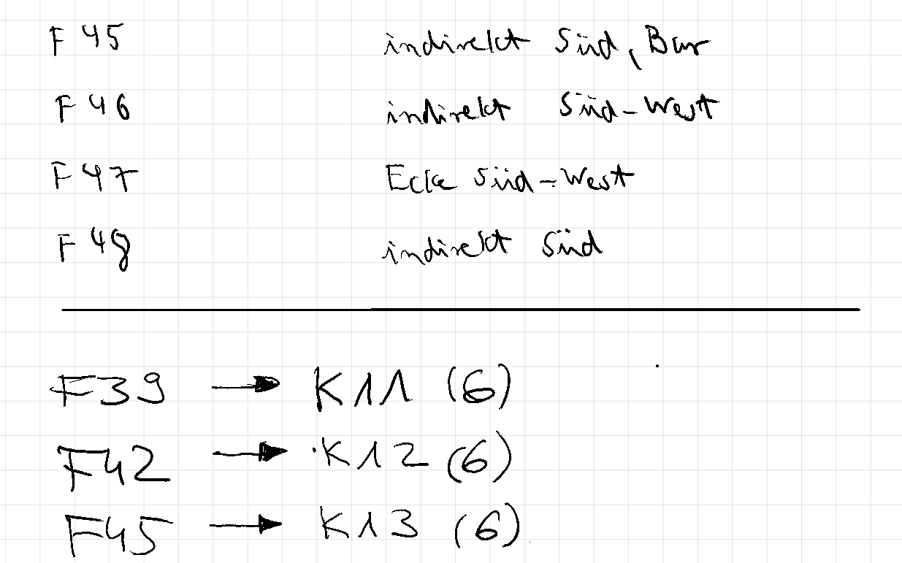
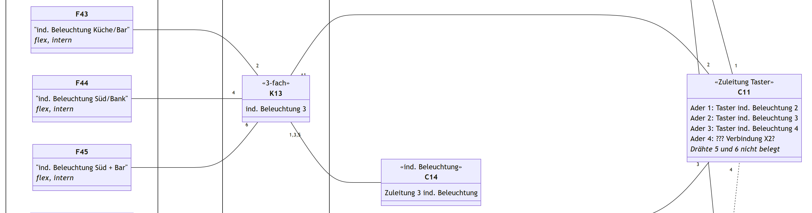
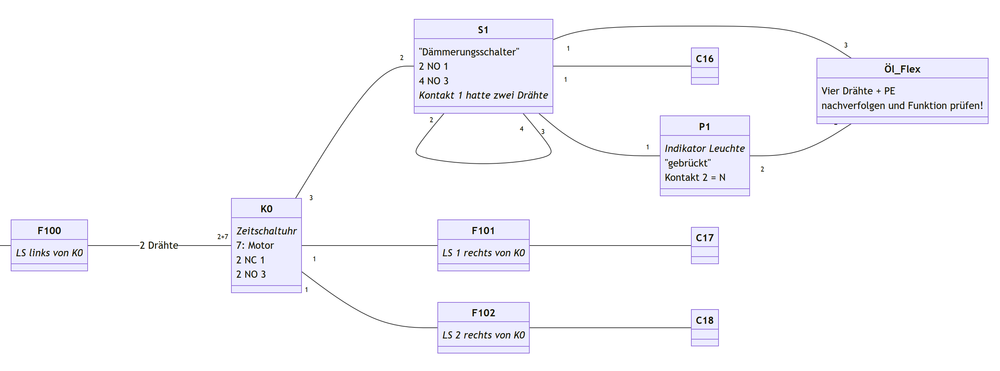
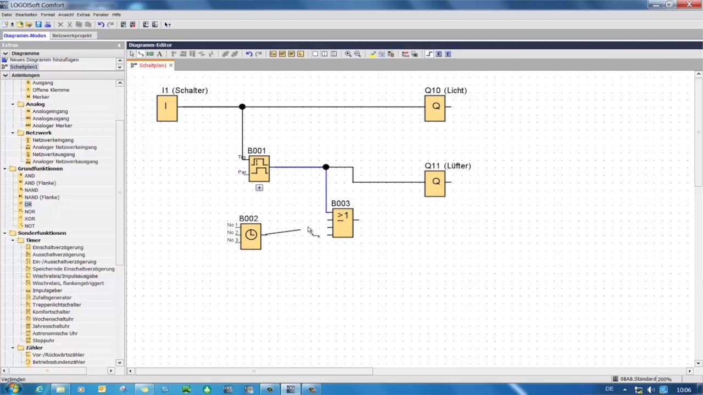

:toc:
:sectlinks:

== The What

I've started a https://github.com/Landhund/Easy_Wiring[new side project]. +
I do not have time for a new side project. +
I knew that when I started it, yet did anyway. +
I did it because my hubris is big enough to believe I am good enough a programmer to create something that would best professional software that costs up to €10.000:

A circuit/wiring diagram software that doesn't. _fucking_. *SUCK!*

== The Why

Early December last year, a long time friend of my brother approached me to ask for my professional advice as an electrician/electrical engineer:
He's part of a local organization that managed to get the usage rights for an unused cafeteria in an old industrial plant in town.
They want to use those rooms for music events, workshops and other local outreach activities.
All in all, great stuff.

The issue is, said cafeteria was last renovated in the late '80s.
And as such isn't at all up to the current electrical codes.footnote:[Electrical installations only have to comply with the electrical codes that are in effect when they are completed. Future changes of the codes does not mean that an electrical installation has to be updated or rebuild (unless the updated code explicitly states otherwise, which happens very rarely). However, this protection of already existing installations disappears when the usage of a room/building changes drastically. And switching from being a cafeteria to an event location unfortunately falls into the category of drastic change.]
So, I take a look at the installations and take a deep sigh.

.The old panel, still covered. So far, not too bad, just old. Although a bit smokey up top...

.The old panel exposed, in all its unsafe glory. The current German Electrical Code states that even when opened up, active elements (i.e. parts that carry current) must still be protected against direct touch with bare fingers footnote:[Since this is Germany, there is indeed a https://www.kan.de/fileadmin/Redaktion/Dokumente/KAN-Studie/de/2012_prueffinger.pdf[Standard] for how to test for that.]. This... isn't.

This would be tricky.
footnote:[Fun fact: it is indeed guild law that an electrician has to take a deep sigh as they look at your distribution panel, followed by a comment akin to "This is gonna be expensive..."]footnote:[Well, no, it's not guild law, but it doesn't have to be, it's always going to be tricky and expensive. And yes, it _is_ always the last guys fault. Even if the last guy was yourself.]footnote:[_Especially_ if the last guy was yourself...]

Fast-forward to the week before last, and I'm painstakingly dismantling the old distribution panel, carefully taking notes of which breaker is connected to which relay/connector, cable or terminal.

.Extract of my notes. Written on a https://remarkable.com/[reMarkable 2].

The next day I take my handwritten notes and create a (very simple) circuit diagram of the old panel using https://mermaid.js.org/[Mermaid].

.Extracts of the Mermaid diagram. The numbers next the connecting lines mark the terminal of the connected element or the wire number of the cable, respectively.

Now, this isn't something I would release to a client, but for a quick and dirty solution to coalesce the scattered notes of `Circuit Breaker X -> Relay Y, Terminal Z` into a clear overview it was perfect.
With it, I was able to make sense of the wiring, assign multiple cables a label based on an educated guess on their function.
I still had footnote:[and still _have_] a few cables where I don't have any idea where they lead and what they do, but I know enough to get the new system going.

For the new distribution panel, I'll be using a https://www.siemens.com/global/en/products/automation/systems/industrial/plc/logo.html[Siemens LOGO!] PLC footnote:[https://en.wikipedia.org/wiki/Programmable_logic_controller[Programmable Logic Controller]] instead of individual https://en.wikipedia.org/wiki/Relay#Latching_relay[impulse switches].
Why not just use impulse switches? Because I've found a used LOGO! with 12 inputs and 8 outputs in top condition for just €60, including shipping and a new programming cable.
That's the same cost as just 3 https://www.amazon.de/Eltako-S12-100-8V-Stromstoss-Schalter/dp/B000UW4G2G[new impulse switches].
And I already need at least 3 switchable circuits for the main room alone, never mind the connection hallway and auxiliary rooms.
So LOGO! it is!

And this, _finally_, brings us to the impetus for my foolishness of starting a new side project.

== The Problem

So, I want to use the PLC to control the lighting in the various rooms.
I have two cables with 6 wires each connected to as many individual switches.
I've also already set up a secondary distribution panel for terminating the various old cables and then running just one wire to the PLC terminal that will be switching them.
But _how_ exactly will I group the cables, which wire of which cable will go to which terminal and from there to the PLC inputs?

This is one of the main problems to solve when building a new electrical system, especially when you are constrained by already existing wiring.
And of course there is software to help you do it.
Except it sucks.
All of it.

=== Caneco BT

https://www.ige-xao.com/en/uk/caneco-bt/[Caneco BT] is the distribution panel planning software we use at the company I work for.
Subpar for this particular job.
It's designed to calculate the various loads and if the shutdown conditions specified in the code are met, not laying out the terminals.
Which is fine, since that is exactly the service we offer (among others).
It's also way too unwieldy for it to be worth to spin up for just helping a friend.
footnote:[Yes, I can see the irony...]

=== AutoCAD Electrical

We also use AutoCAD MEP at work for general electrical drawings.
And since I've got the https://www.autodesk.eu/collections/architecture-engineering-construction/overview[AEC-Collection] (mainly for Revit), I also have access to https://www.autodesk.eu/products/autocad/included-toolsets/autocad-electrical#![AutoCAD Electrical].
So I thought, why not try it out.
But man, it really isn't worth the time to get into it and most certainly not the money they ask for.

I'm used to features that only work after you invested a couple of hours into manually configuring the _required_ formatting settings, but for software that costs €2.300+ _per year for 1 user_, this is just embarrassing.
And I'm not talking about some special element or situation, no, I mean that when I place a simple circuit breaker _from the included library_, enter the _requested_ data (ID, amperage, shut-off characteristic, etc.), the thus created labels not only badly overlay the symbol, _but also each other_.

Not a good start.
Next I tried to draw a simple "wire connection" between two points.
Not terminals or specific connection points of some element, just a wire from empty space to empty space.
What was created was just as embarrassing: 4 unconnected lines footnote:["Line _segments_", for any mathematicians reading this.].
As in, when I move one line, the others would not stay connected or move with it.
They just sit there.

And I know AutoCAD can do connected line segments.
They are called Polylines and I use them all the time.
You can even create a single Polyline from multiple individual lines, including a specifiable fuzziness of how close the ends of those lines have to be to each other.
But AutoCAD Electrical doesn't use that functionality for wires.
It just places dumb lines.

Disqualified.

=== Autodesk Eagle

"Cloud based CAD-software from Autodesk."
After spending plenty of time with Autodesk software over the past 6 years, there are few sentences that make me doubt the usability of a product more than that sentence.
Since I don't have access to Autodesk Fusion, am not particularly willing to endure a trial period for it and Eagle seems to be focused on PCB-design anyway, I gave it a pass.

=== Altium

I've read the name https://www.altium.com/[Altium] a few times in forums and software lists while looking for software
Way beyond what I am willing (pretty much €0) or even _capable_ of paying for software for a simple side project.
And by the looks of it also actually a PCP-layout software.

=== profiCAD

https://www.proficad.com/screenshots.aspx[No.]

=== Various Online Platforms

I've also (of course) found many web-based programs that promise some kind of circuit diagram functionality.
These include, but are not limited to:

* https://www.lucidchart.com/[Lucidchart]
* https://www.smartdraw.com/[Smartdraw]
* https://www.edrawsoft.com/edraw-max/[EdreawMax]
* https://www.circuit-diagram.org/[Cicuit Diagram]
* https://www.conceptdraw.com/[Concept Draw]

All of them, to a fault, behave the same:
General purpose diagram tool; technically free to use (with heavy limitations); laughable electrical symbol library (if advertised), that falls apart the instant you want to use it for actual real world situations.

== The "Winner"

https://draw.io[draw.io]

Seriously, of all the programs, apps, "solutions", etc. I've tested, god-damn draw.io is the winner.
Doesn't mean it can do _everything_ I would like it to, but damn is it close.
In fact, if it wasn't for just _one_ thing, I would have used it and never thought of writing a single line of code footnote:[still haven't yet, actually...].

== The Requirements

I think I should finally give a list of features I would like the tool I envision to have:

* Every element (except wires, naturally) in the diagram is an entity with defined connection points.
Ideally, these points have some sort of label or ID.
* Wires can be drawn between two connection points via drag-and-drop, snapping to nearby connectors.
* The wires are only drawn orthogonally.
* When an element is moved, the connected wires stretch and move as needed to stay connected and orthogonal.
* I can create my own elements, with custom defined connectors.

That's it.
Those are my bare minimum requirements.
draw.io meets all of them except the last one, which was the straw that broke the camel's back and made me start this madness of a side project.

Especially since I know another software that dose all of that (except the custom elements part):
*LOGO!Soft Comfort*, the software used to program the very LOGO! I'm using in my new distribution panel!
And that think is _ancient_!
I mean, just look at it:

.An official screenshot overview of LOGO!Soft Comfort.

I've disqualified profiCAD for just looking this old!
But I've used LOGO!Soft Comfort before.
It's actually easy to use.
Almost _pleasurable_ even, if you are willing to believe there is professional software out there that actually has good UX.
You can even simulate the program completely with just a click!

Anyway, before I derail myself completely writing stuff I've already written somewhere else, I'll just refer to my preliminary https://github.com/Landhund/Easy_Wiring/blob/main/design.adoc[Design Document] on GitHub.

== The Plan™

=== The Framework

After looking around with my idea now fixed in my brain (somewhat against my wishes), I've looked around for an idea of how to realize the "canvas" where all the elements and connections would be placed and manipulated.
The issue is, that I've never written something like that.
I've written GUI's before, sure, but only using libraries.
But a canvas like one I need for the project was/is something I don't even now where to start with.

Luckily I don't have to!
https://excalidraw.com/[Excalidraw] already has a wide array of features I could use and is (luckily) open source.

Funnily enough I stumbled over Excalidraw while looking for a tool to export my Mermaid diagram to PDF.
When I imported the diagram to it, I was amazed to see the created lines automatically moving to stay connected with their endpoint-elements when I accidentally moved a block.

So I've downloaded its https://github.com/excalidraw/excalidraw[source code] from GitHub, validated I could run it locally (which was surprisingly easy) and now plan to rip out everything I don't need and hammer the rest into the desired shape. footnote:[You may be able to tell that I've got some experience on construction sides...]

=== Deployment/Release

Since I don't want to care for an online service, I've taken the recommendation of a friend of mine (who's a professional web-developer) and decided to use https://tauri.app/[Tauri] to (at some point) create releases.

== The Future

I wouldn't hold my breath as to when I'll be able to get this project going.
I really want to actually write it, but until at least August my free time is _very_ limited supply.
But who knows, maybe eventually I'll really sink my teeth into it...
